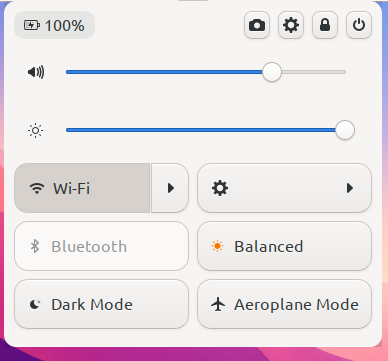
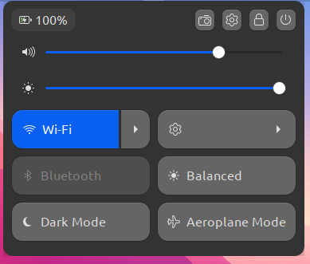
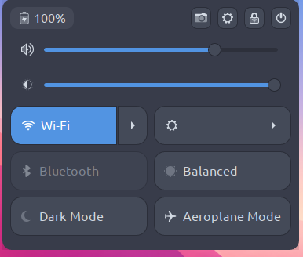

[English](README.md)
# Extras Menu

XFCE4 panel eklentisi. GNOME'un "hızlı ayarlar" menüsüne benzer, panelde
tek bir düğmeyle açılan bir açılır pencere sunar: ses ve ekran parlaklığı
kaydırıcıları, ayrıca Bluetooth / Wifi/ethernet / Aeroplane Mode gibi hızlı
geçiş düğmeleri.

Şuan alpha aşamasındadır ayrıca çalışan tuşlar şunlar Wifi/ethernet, parlaklık kontrolü, ses kontrolü, yukarıdaki küçük düğmeler (güç tuşu, screenshot tuşu vb) **daha hala ekleniyor teker teker**

## Görseller



## Bağımlılıklar

### Arch Linux

```bash
sudo pacman -S brightnessctl --needed
```

### Debian / Ubuntu

```bash
sudo apt install brightnessctl
```

### Fedora

```bash
sudo dnf install brightnessctl
```

## Derleme ve kurulum

```bash
make
make install
```

Kurulumdan sonra paneli yeniden başlatmak (tavsiye edilir):

```bash
xfce4-panel -r
```

Panelde sağ tık → Panel → Öğe Ekle... üzerinden "Extras Menu" olarak eklenebilir.

## Notlar

1. şuan ismi extras menu ama gelecekte Gnome-quick-settings veya Quick-settings-Gnome-style gibi bişi yapmayı planlıyorum.
2. gelecekte install.sh yapacağım ama şuan kod mantığındayım ve geliştirmeye devam ediyorum. (yakın zamanda yapacağım.)
3. bazı şeyleri örneğin dark mode veya balanced rasgele ekledim gelecekte daha geliştiğinde varsayılan gelen düzeni daha kullanışlı yapmayı planlıyorum.